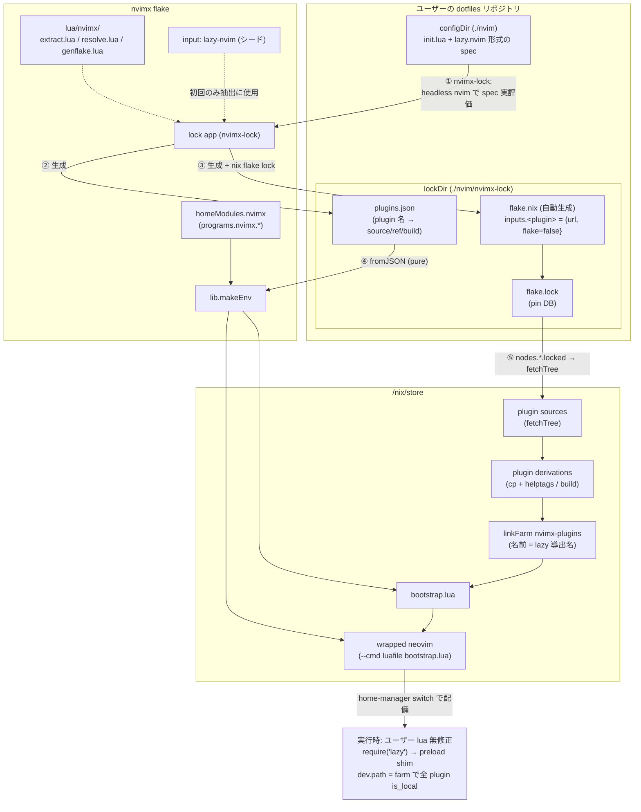
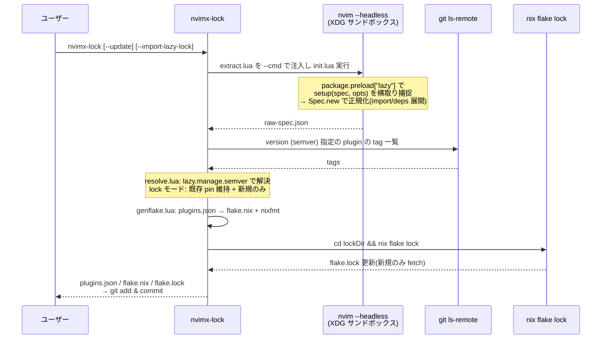
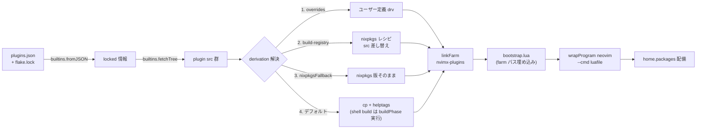

# nvimx アーキテクチャ設計

## 概要

nvimx は「neovim の Lua の柔軟性 × nix の再現性」を両立する nix x neovim manager。

- home-manager module を提供し、ユーザーの dotfiles に組み込める
- lazy.nvim 形式の lua を解析し、必要な plugin を取得し flake.lock に pin する
- neovim 本体は nixpkgs / neovim-nightly-overlay をユーザーが自由に選択できる

モデルは **twist.nix 型**: lua を解析 → GitHub から plugin 取得 → /nix/store 配置 → symlink。
lock 情報は nvimx 専用の flake.nix を自動生成し flake.lock で pin する。
`nix run .#lock` で再評価・更新し、home-manager build は flake.lock から pure に評価する。

### 確定済みの設計判断

1. **解析**: `nix run .#lock` 実行時に headless nvim がユーザーの lazy spec を実評価(評価時 IFD なし)
2. **ランタイム**: lazy.nvim をそのまま使用。ユーザーの lua は無修正で動く
3. **build 付き plugin** (telescope-fzf-native 等): 初期からフル対応

## アーキテクチャ図

### 全体像



### lock フロー(`nvimx-lock`)



### build フロー(`home-manager switch`、完全 pure)



## 設計原則

1. **lock 成果物 = コミットされた `plugins.json` + `flake.lock` が唯一の真実**。
   build 時は JSON を `builtins.fromJSON` で読むだけの完全 pure 評価。
   twist.nix が必要とする初回 `--impure` は原理的に不要(eval 時に解決すべき未知情報が存在しない)。
2. **spec 正規化は lazy.nvim 自身にやらせる**。
   lazy の `Spec` が導出した plugin 名をそのまま symlink farm のディレクトリ名に使う → nix 側ディレクトリ名と lazy の plugin 名の一致が構成上保証される(突き合わせロジックを自作しない)。
3. **lock パイプラインは `nvim -l` (Lua) に統一**。
   lazy.nvim 同梱の semver モジュール (`lazy.manage.semver`) を再利用し、version 解決セマンティクスが lazy と完全に同一になる。
4. **ランタイム注入は wrapper `--cmd luafile` + `package.preload["lazy"]` のみ**。
   ユーザーの lua は無修正。

## データフロー

### lock 時 (`nvimx-lock` / `nix run .#lock`)

```
[1] 抽出用 lazy.nvim を選択:
      ユーザーの lock に lazy.nvim があればそれ(locked store path)
      なければ nvimx 自身の flake input のシード(鶏卵問題の解消)
[2] 抽出: XDG_{CONFIG,DATA,STATE,CACHE}_HOME をサンドボックス化し
      nvim --headless --cmd "luafile extract.lua"
      - package.preload["lazy"] で setup(spec, opts) を横取り捕捉(本物の setup は呼ばない)
      - Config.setup(安全 opts をマージ) → Spec.new(spec, {pkg=false}) で正規化
        (import 再帰解決・fragment マージ・dependencies 展開まで lazy 自身のロジック)
      → raw-spec.json
[3] 解決: nvim -l resolve.lua
      - version (semver range) を git ls-remote --tags + lazy.manage.semver で解決
      - lock モード: 既存 pin 維持 + 新規のみ解決 / update モード: 全再解決
      → plugins.json
[4] 生成: nvim -l genflake.lua
      → lockDir/flake.nix (inputs.<name> = { url = ...; flake = false; }, outputs = _: {})
      → nixfmt で整形
[5] lockDir に配置し (cd lockDir && nix flake lock)
      → flake.lock 生成/更新(lock モードでは既存 node は不変、新規のみ fetch)
```

### build 時 (`home-manager switch`) — 完全 pure、ネットワーク不要

```
[1] lockDir/plugins.json + flake.lock を builtins.fromJSON で読む
      ※ lock flake は flake として評価しない。flake.lock は単なる pin DB
[2] nodes.<inputName>.locked → builtins.fetchTree → src
[3] plugin derivation 化: overrides > build-registry > デフォルト(cp + helptags)
[4] linkFarm "nvimx-plugins" [ { name = <lazy 導出名>; path = drv; } ... ]
[5] bootstrap.lua 生成(farm パス・強制 opts を埋め込み)
      → neovim (ユーザー選択 package) を wrapProgram --cmd 'luafile <bootstrap.lua>'
[6] hm 配備:
      home.packages = [ wrapped-nvim, nvimx-lock ]
      xdg.configFile."nvim" = configDir            (manageConfig = true 時)
      xdg.dataFile."nvim/lazy/lazy.nvim" → farm/lazy.nvim
        (既存 bootstrap snippet の git clone を無害化)
```

実行時: ユーザーの init.lua がそのまま走り、`require("lazy")` は preload 経由で強制 opts がマージされた setup になる。全 plugin が `dev.path = farm, patterns = {""}, fallback = false` で `is_local` 扱い → lazy の git/install パイプラインを完全スキップし、store から読み込む。

## 主要コンポーネント

### plugins.json スキーマ

```jsonc
{
  "schemaVersion": 1,
  "lazyNvim": { "inputName": "lazy-nvim", "synthetic": true },  // 常に存在
  "plugins": {
    "telescope.nvim": {                     // キー = lazy が導出した plugin 名 (= farm dir 名)
      "inputName": "telescope-nvim",        // flake input 名 ([^A-Za-z0-9_-] → "-")
      "source": { "type": "github", "owner": "nvim-telescope", "repo": "telescope.nvim" },
      "branch": null, "tag": null, "commit": null,
      "version": "^0.1",                    // 元の semver 制約(情報保持)
      "resolvedRef": "refs/tags/0.1.8",     // lock 時に解決した ref (null = default branch)
      "build": { "kind": "none" }           // "none" | "shell" | "excmd" | "function"
    }
  },
  "localPlugins": { "myplugin": { "dir": "~/projects/myplugin" } },  // dir 指定。lock 対象外
  "warnings": [ "..." ]
}
```

- `enabled = false` リテラルの plugin は除外。関数 / `cond` 付きは**包含**(マシン依存分岐のスーパーセットを lock)
- `lazyNvim` エントリ常設: 2 回目以降の抽出・ランタイムは同一の locked lazy.nvim を使い、名前導出規則のバージョン skew を防ぐ

### lazy spec → flake input URL マッピング

| lazy 指定 | flake input URL | `nix flake update` の挙動 |
|---|---|---|
| 指定なし | `github:owner/repo` | default branch HEAD に追従 |
| `branch = "b"` | `github:owner/repo/b` | branch HEAD に追従 |
| `tag = "t"` | `github:owner/repo/refs/tags/t` | 不動 |
| `commit = "sha"` | `github:owner/repo/<sha>` | 不動 |
| `version = "^1.2"` | 解決した tag で `refs/tags/vX.Y.Z` | 不動(`--update` で再解決) |
| `pin = true` | 現 lock の rev を凍結 | 不動 |
| git URL 直指定 | `git+https://...?ref=...`(github.com は github 型に正規化) | ref に追従 |

**semver 解決**: `git ls-remote --tags`(peeled `^{}` 優先)で tag 一覧を取得し、lazy 同梱の `lazy.manage.semver` を `nvim -l` から呼ぶ。GitHub API は使わない(レート制限・非 GitHub 対応のため)。

### 更新セマンティクス

- `nvimx-lock`: 新規 plugin の追加 + 除去された plugin の削除のみ。既存 pin は不変
- `nvimx-lock --update [name...]`: version 制約の再解決 + `nix flake update [name...]`
- 裏口: lockDir で素の `nix flake update <inputName>` も可(twist と同じ)
- `nvimx-lock --import-lazy-lock <path>`: 既存 lazy-lock.json の `{branch, commit}` で初回 pin し bit-identical 移行。`--update` 時点で通常追従に復帰

### plugin derivation(1 plugin = 1 derivation)

fetchTree 結果の直接使用は不採用: helptags が生成されず `:h` が死ぬ、build 統合が不可能。

- **デフォルト**: `runCommand` で `cp -r src $out` + `doc/` があれば helptags 生成。
  `vimUtils.buildVimPlugin` は require チェックの偽陽性が多くデフォルトでは使わない
- **build 解決順序**:
  1. ユーザー `plugins.overrides."<lazy名>" = { pkgs, src, defaultDrv }: drv;`
  2. 組み込み registry (`nix/build-registry/`): **nixpkgs vimPlugins レシピの src 差し替え**
     (`overrideAttrs (o: { src = <locked src>; })`)で pin セマンティクスを保ったまま nixpkgs のビルドノウハウを再利用
  3. `plugins.nixpkgsFallback = [ "..." ]`(opt-in): nixpkgs 版をそのまま使用(pin 一貫性が崩れるため自動 name-match はしない)
  4. `build.kind == "shell"` はデフォルト buildPhase で実行(ネットワーク不要な make/cmake 系はこれで動く)。
     `excmd`/`function` は 1〜3 が無ければ eval 時 warning(helptags のみで続行)
- **nvim-treesitter**: 本体(src 差し替え)+ nixpkgs の grammar 群を **symlinkJoin で単一 derivation にマージ**(farm 1 エントリで完結。別 rtp エントリは `performance.rtp.reset` と干渉するため不採用)。
  `treesitter.grammars = "all" | [ names ] | null`。grammar rev と本体 rev の微差は既知の制限(将来: locked src の lockfile から grammar を直接ビルドする厳密モード)

### ランタイム注入(bootstrap.lua)

1. `vim.opt.rtp:prepend(farm .. "/lazy.nvim")`
2. `package.preload["lazy"]` を登録: 初回 require 時に自己解除 → 本物を require → `setup` を monkeypatch(`setup(spec, opts)` / `setup(opts)` 両対応)→ forced opts を `vim.tbl_deep_extend("force", ...)`
3. forced opts: `install.missing=false`, `checker.enabled=false`, `change_detection.enabled=false`, `pkg.enabled=false`, `rocks.enabled=false`, `readme.enabled=false`, `dev = { path = <関数>, patterns = {""}, fallback = false }`
4. **dev.path は関数**: `devPlugins` に含まれる名前は `devPath`(例 `~/projects`)、それ以外は farm を返す → ユーザー自身の plugin ローカル開発 (dev=true) ワークフローを潰さない
5. `xdg.dataFile."<app>/lazy/lazy.nvim"` → farm への symlink で、ユーザーの標準 bootstrap snippet の `fs_stat` が成功し git clone が走らない

読み取り専用 store との整合性: `dir` が lazy root 配下でない plugin は `is_local = true` となり、clone/fetch/checkout/status 等の git タスクと install パイプラインが全てスキップされる(lazy.nvim の実装で保証)。

## home-manager module インターフェース

module が `lib.makeEnv` を内包する(twist と意図的に乖離: twist は複数 profile 配布用途だが、nvimx の主用途は「dotfiles に 1 つの nvim」であり設定 1 箇所の UX が勝る)。上級者向けに `programs.nvimx.env` の直接指定も許す。

```nix
programs.nvimx = {
  enable = true;

  # neovim 本体の選択: -unwrapped 系 drv を渡すだけ
  package = pkgs.neovim-unwrapped;
  # package = inputs.neovim-nightly-overlay.packages.${pkgs.system}.default;

  configDir = ./nvim;              # lua config (path 型 → store へ)
  lockDir   = ./nvim/nvimx-lock;   # plugins.json / flake.nix / flake.lock

  manageConfig = true;             # true: xdg.configFile で store 配備(再現性重視、既定)
                                   # false: ~/.config/nvim はユーザー管理(高速イテレーション派)

  plugins = {
    overrides = { };               # per-plugin derivation 上書き
    nixpkgsFallback = [ ];         # nixpkgs 版をそのまま使う plugin 名 (opt-in)
  };
  treesitter.grammars = "all";     # "all" | [ names ] | null

  devPlugins = [ ];                # ローカル開発中 plugin 名
  devPath = "~/projects";

  extraPackages = [ ];             # wrapper PATH 前置 (ripgrep, lsp 等)
  extraLuaPackages = ps: [ ];      # luarocks 依存の手動供給 (escape hatch)

  lock = {
    installCommand = true;         # nvimx-lock を home.packages に追加
    projectDir = "~/dotfiles";
    lockDirRelative = "nvim/nvimx-lock";
  };
};
```

**lock 不在時は degrade ビルド**(farm = lazy.nvim シードのみ + activation 時警告)。
lock コマンド自体が hm build 産物のため、eval を失敗させると鶏卵になる。degrade モードでも `nvimx-lock` は PATH に入るので、`nvimx-lock` → commit → `home-manager switch` で完全状態に到達できる。`--impure` は一切不要。

## ユーザーから見た使用フロー

```nix
# dotfiles の flake.nix
{
  inputs = {
    nixpkgs.url = "github:nixos/nixpkgs/nixpkgs-unstable";
    home-manager.url = "github:nix-community/home-manager";
    nvimx.url = "github:myuron/nvimx";
  };
  outputs = { nixpkgs, home-manager, nvimx, ... }: {
    homeConfigurations.myuron = home-manager.lib.homeManagerConfiguration {
      pkgs = import nixpkgs { system = "x86_64-linux"; };
      modules = [
        nvimx.homeModules.nvimx
        {
          programs.nvimx = {
            enable = true;
            configDir = ./nvim;
            lockDir = ./nvim/nvimx-lock;
          };
        }
      ];
    };
  };
}
```

- **初回**: `nix run github:myuron/nvimx#lock -- --config ./nvim --out ./nvim/nvimx-lock`
  (既存 lazy 環境からは `--import-lazy-lock ~/.config/nvim/lazy-lock.json` 併用)
  → `git add` → `home-manager switch`。先に switch(degrade)→ `nvimx-lock` の順でも可
- **plugin 追加**: lua に spec を書く → `git add` → `nvimx-lock`(新規のみ fetch)→ commit → switch。
  lock 忘れで switch しても nvim は起動し、当該 plugin のみ not installed 表示(安全な失敗)
- **更新**: `nvimx-lock --update`(全体)/ `nvimx-lock --update telescope.nvim`(個別)→ switch。
  flake.lock が動かない限り何度 switch しても同一結果

## リポジトリ構成

```
flake.nix                    # lazy-nvim input 追加、outputs 拡張
nix/
  lib/
    default.nix              # lib エントリ (makeEnv, mkLockApp)
    make-env.nix             # env 組み立ての中核
    sources.nix              # flake.lock JSON → name → fetchTree src
    plugin-drv.nix           # 1 plugin derivation 化 (helptags / build / override 解決)
    farm.nix                 # linkFarm 構築
    bootstrap.nix            # bootstrap.lua 生成
    wrapper.nix              # neovim の wrapProgram
    treesitter.nix           # nvim-treesitter + grammar マージ derivation
    lock-app.nix             # lock スクリプト (writeShellApplication)
  build-registry/            # 名前 → ビルドレシピ (telescope-fzf-native.nvim 等)
  home-manager/default.nix   # programs.nvimx モジュール
lua/nvimx/
  extract.lua                # preload shim + spec 捕捉 + 正規化 + JSON dump
  resolve.lua                # semver 解決 + 前回 plugins.json とのマージ
  genflake.lua               # plugins.json → lock/flake.nix テキスト生成
  bootstrap.lua.in           # ランタイム bootstrap テンプレート
templates/default/           # dotfiles 組み込み雛形
tests/fixtures/              # basic-config / build-plugins / golden/
```

flake outputs:

- `lib.{makeEnv, mkLockApp}`
- `homeModules.nvimx`
- `apps.x86_64-linux.lock`(スタンドアロン、ブートストラップ・CI 用)
- `packages.x86_64-linux.demo`(fixture を使った動作確認・dogfooding 用)
- `checks.x86_64-linux.{extractor-snapshot, genflake-golden, e2e-offline}`
  (e2e-offline は path 型 input の fixture lock でネットワークなし E2E)
- `templates.default`

## エッジケースと明示的な制限

| ケース | 挙動 / 対応 |
|---|---|
| 初回 bootstrap (lock 不在) | degrade ビルド + 警告。`--impure` 不要 |
| lock 後に lua へ plugin 追加して switch | eval 成功、当該 plugin のみ未インストール表示。警告で lock 再実行を促す |
| git 未追跡の lua ファイル | flake source に入らず抽出漏れ → lock app が作業ツリー差分を検知して warn |
| GitHub 以外 / git URL 直指定 | `git+https://` / `git+ssh://` input に正規化 |
| plugin 名衝突 | lazy の Spec 正規化段階で顕在化(lazy と同じ挙動)。inputName 衝突は lock 時エラー |
| build が Lua 関数 / excmd | 自動実行不可。lock 時に警告し registry / overrides / nixpkgsFallback を案内 |
| luarocks (rocks) | **非対応を明示**。`rocks.enabled=false` 強制。`extraLuaPackages` が escape hatch |
| マシン依存 spec (`enabled = fn`, `cond`) | スーパーセットを lock。spec リスト自体の if 分岐は lock 実行マシンの分岐のみ(文書化) |
| plugin ローカル開発 (dev=true) | `devPlugins` / `devPath` + dev.path 関数で両立 |
| lazy の state 書き込み | stdpath(data/state/cache) はユーザー領域なので問題なし |
| treesitter grammar rev の微差 | 既知の制限。将来厳密モード |

## 実装フェーズ

各フェーズ末に動作確認可能な成果物を置く:

1. **抽出器**(最大リスク先行): `extract.lua` + fixture → raw-spec.json、`checks.extractor-snapshot`。lazy-nvim を flake input に追加
2. **lock パイプライン**: `genflake.lua` + lock app → `nix run .#lock` で lockDir 一式生成、golden テスト
3. **build 経路**: sources / plugin-drv / farm / bootstrap / wrapper → `packages.demo` で `:Lazy` 全 loaded/local 確認。dogfooding 開始
4. **hm module + template**: `programs.nvimx.*`、degrade モード、`nvimx-lock`、実 dotfiles E2E
5. **build plugin フル対応**: build-registry、shell build、treesitter マージ drv、nixpkgsFallback、lock 時警告
6. **version/更新系**: `resolve.lua`(semver)、`--update [name]`、pin 維持マージ、`--import-lazy-lock`
7. **仕上げ**: devPlugins、extraLuaPackages、非 GitHub 検証、`checks.e2e-offline`、README

## 検証方法

- Phase 1-2: fixture config に対し `nvim --headless --cmd "luafile extract.lua"` → JSON 確認 → snapshot check 化。`nix run .#lock` 後に `cd lockDir && nix flake lock` が成功すること
- Phase 3 以降: `nix build .#demo && ./result/bin/nvim` で `:Lazy` を開き全 plugin が loaded/local(git 操作なし)、`:h telescope` が引けること
- Phase 4: 実 dotfiles で `nvimx-lock` → commit → `home-manager switch` → flake.lock 不変のまま再 switch して同一結果であること
- CI: `nix flake check`(オフライン checks)+ `nix fmt` 済み確認

## 参考: twist.nix からの主な乖離点

| 項目 | twist.nix | nvimx | 理由 |
|---|---|---|---|
| パッケージ解決のタイミング | eval 時(pure Nix の elisp パーサ) | lock 時(headless nvim) | Lua は pure Nix でパース不能。lock 時解決により eval が完全 pure になり `--impure` 不要 |
| 解決結果の永続化 | metadata.json(IFD 回避のオプション) | plugins.json(必須、唯一の真実) | 同上 |
| lock flake の扱い | flake.lock を importJSON + fetchTree | 同じ | 実証済みパターンをそのまま採用 |
| env 構築の場所 | ユーザー flake の packages 側 | hm module 内包(env 直接指定も可) | 単一 profile 用途では設定 1 箇所が勝る |
| 未 pin 時の挙動 | impure fetch にフォールバック | degrade ビルド | eval 時に未知情報がないため impure の出番がない |
