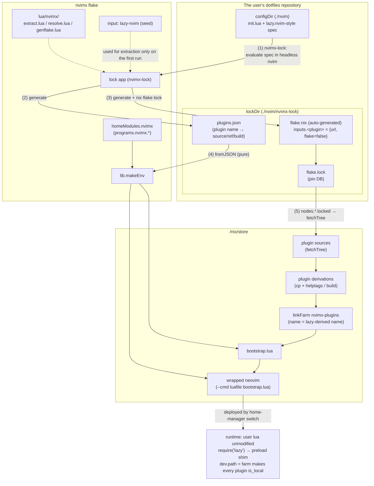
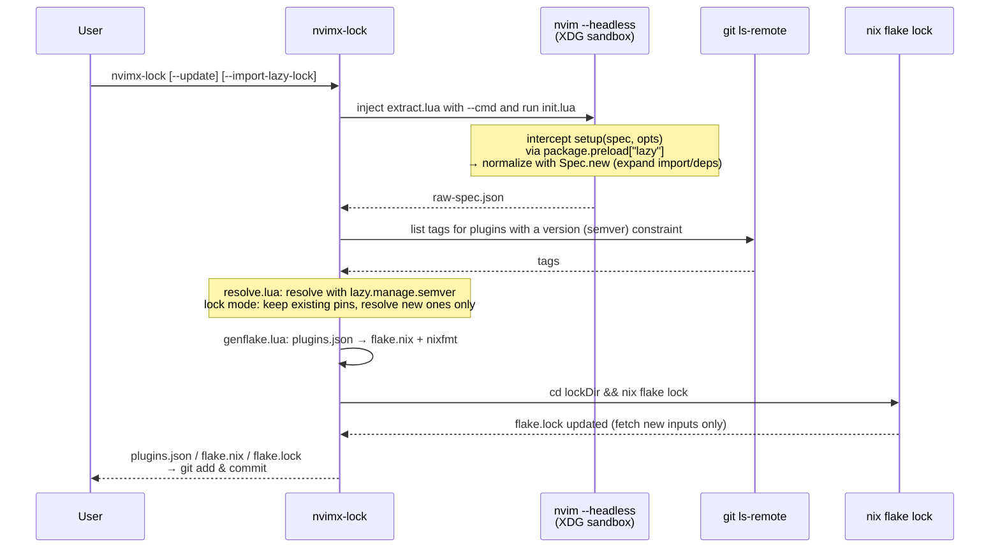
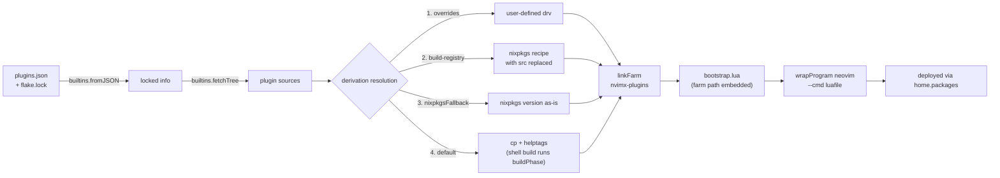

# nvimx architecture

## Overview

nvimx is a nix x neovim manager that combines "the flexibility of neovim's Lua" with "the reproducibility of nix".

- Provides a home-manager module that can be embedded in the user's dotfiles
- Parses lazy.nvim-style lua, fetches the required plugins, and pins them in flake.lock
- Lets the user freely choose neovim itself from nixpkgs or neovim-nightly-overlay

The model is **twist.nix style**: parse lua → fetch plugins from GitHub → place in /nix/store → symlink.
Lock information is stored by auto-generating an nvimx-specific flake.nix and pinning it with flake.lock.
`nix run .#lock` re-evaluates and updates it, and the home-manager build evaluates purely from flake.lock.

### Settled design decisions

1. **Parsing**: when `nix run .#lock` runs, a headless nvim actually evaluates the user's lazy spec (no IFD at evaluation time)
2. **Runtime**: lazy.nvim is used as-is. The user's lua runs unmodified
3. **Plugins with a build step** (telescope-fzf-native, etc.): fully supported from the start

## Architecture diagrams

### Big picture



### Lock flow (`nvimx-lock`)



### Build flow (`home-manager switch`, fully pure)



## Design principles

1. **The lock artifacts — the committed `plugins.json` + `flake.lock` — are the single source of truth**.
   At build time the JSON is simply read with `builtins.fromJSON`, so evaluation is fully pure.
   The initial `--impure` that twist.nix requires is unnecessary in principle (there is no unknown information left to resolve at evaluation time).
2. **Let lazy.nvim itself normalize the spec**.
   The plugin names derived by lazy's `Spec` are used verbatim as directory names in the symlink farm → the nix-side directory names and lazy's plugin names are guaranteed to match by construction (no hand-rolled reconciliation logic).
3. **The lock pipeline is unified on `nvim -l` (Lua)**.
   Reusing the semver module bundled with lazy.nvim (`lazy.manage.semver`) makes the version resolution semantics identical to lazy's.
4. **Runtime injection is limited to the wrapper's `--cmd luafile` + `package.preload["lazy"]`**.
   The user's lua stays unmodified.

## Data flow

### At lock time (`nvimx-lock` / `nix run .#lock`)

```
[1] Select the lazy.nvim used for extraction:
      the one in the user's lock if present (locked store path)
      otherwise the seed from nvimx's own flake input (resolves the chicken-and-egg problem)
[2] Extraction: sandbox XDG_{CONFIG,DATA,STATE,CACHE}_HOME and run
      nvim --headless --cmd "luafile extract.lua"
      - intercept setup(spec, opts) via package.preload["lazy"] (the real setup is never called)
      - Config.setup (merging safe opts) → Spec.new(spec, {pkg=false}) to normalize
        (recursive import resolution, fragment merging, dependency expansion — all lazy's own logic)
      → raw-spec.json
[3] Resolution: nvim -l resolve.lua
      - resolve version (semver range) with git ls-remote --tags + lazy.manage.semver
      - lock mode: keep existing pins, resolve new ones only / update mode: re-resolve everything
      → plugins.json
[4] Generation: nvim -l genflake.lua
      → lockDir/flake.nix (inputs.<name> = { url = ...; flake = false; }, outputs = _: {})
      → formatted with nixfmt
[5] Place it in lockDir and run (cd lockDir && nix flake lock)
      → generate/update flake.lock (in lock mode existing nodes stay untouched, only new ones are fetched)
```

### At build time (`home-manager switch`) — fully pure, no network required

```
[1] Read lockDir/plugins.json + flake.lock with builtins.fromJSON
      NOTE: the lock flake is never evaluated as a flake. flake.lock is just a pin DB
[2] nodes.<inputName>.locked → builtins.fetchTree → src
[3] Turn plugins into derivations: overrides > build-registry > default (cp + helptags)
[4] linkFarm "nvimx-plugins" [ { name = <lazy-derived name>; path = drv; } ... ]
[5] Generate bootstrap.lua (embedding the farm path and the forced opts)
      → wrapProgram neovim (the user-selected package) with --cmd 'luafile <bootstrap.lua>'
[6] hm deployment:
      home.packages = [ wrapped-nvim, nvimx-lock ]
      xdg.configFile."nvim" = configDir            (when manageConfig = true)
      xdg.dataFile."nvim/lazy/lazy.nvim" → farm/lazy.nvim
        (neutralizes the git clone in the user's existing bootstrap snippet)
```

At runtime the user's init.lua runs as-is, and `require("lazy")` goes through the preload shim so that `setup` receives the merged forced opts. Every plugin is treated as `is_local` via `dev.path = farm, patterns = {""}, fallback = false` → lazy's git/install pipeline is skipped entirely and everything is loaded from the store.

## Main components

### plugins.json schema

```jsonc
{
  "schemaVersion": 1,
  "lazyNvim": { "inputName": "lazy-nvim", "synthetic": true },  // always present
  "plugins": {
    "telescope.nvim": {                     // key = plugin name derived by lazy (= farm dir name)
      "inputName": "telescope-nvim",        // flake input name ([^A-Za-z0-9_-] → "-")
      "source": { "type": "github", "owner": "nvim-telescope", "repo": "telescope.nvim" },
      "branch": null, "tag": null, "commit": null,
      "version": "^0.1",                    // the original semver constraint (kept for reference)
      "resolvedRef": "refs/tags/0.1.8",     // the ref resolved at lock time (null = default branch)
      "build": { "kind": "none" }           // "none" | "shell" | "excmd" | "function"
    }
  },
  "localPlugins": { "myplugin": { "dir": "~/projects/myplugin" } },  // dir-specified. not locked
  "warnings": [ "..." ]
}
```

- Plugins with a literal `enabled = false` are excluded. Those with a function or `cond` are **included** (a superset of the machine-dependent branches is locked)
- The `lazyNvim` entry is always present: extraction and runtime from the second run onward use the same locked lazy.nvim, preventing version skew in the name derivation rules

### lazy spec → flake input URL mapping

| lazy spec | flake input URL | behavior of `nix flake update` |
|---|---|---|
| unspecified | `github:owner/repo` | follows the default branch HEAD |
| `branch = "b"` | `github:owner/repo/b` | follows the branch HEAD |
| `tag = "t"` | `github:owner/repo/refs/tags/t` | frozen |
| `commit = "sha"` | `github:owner/repo/<sha>` | frozen |
| `version = "^1.2"` | `refs/tags/vX.Y.Z` for the resolved tag | frozen (re-resolved with `--update`) |
| `pin = true` | freezes the current lock's rev | frozen |
| explicit git URL | `git+https://...?ref=...` (github.com is normalized to the github type) | follows the ref |

**semver resolution**: the tag list is obtained with `git ls-remote --tags` (preferring peeled `^{}`) and lazy's bundled `lazy.manage.semver` is called from `nvim -l`. The GitHub API is not used (rate limits, and non-GitHub support).

### Update semantics

- `nvimx-lock`: only adds new plugins and removes deleted ones. Existing pins stay untouched
- `nvimx-lock --update [name...]`: re-resolves version constraints + `nix flake update [name...]`
- Back door: plain `nix flake update <inputName>` in lockDir also works (same as twist)
- `nvimx-lock --import-lazy-lock <path>`: pins from an existing lazy-lock.json's `{branch, commit}` on the first run for a bit-identical migration. Returns to normal tracking at `--update` time

### Plugin derivations (1 plugin = 1 derivation)

Using the fetchTree result directly was rejected: helptags are not generated so `:h` breaks, and build integration becomes impossible.

- **Default**: `runCommand` doing `cp -r src $out` + generating helptags if `doc/` exists.
  `vimUtils.buildVimPlugin` produces too many false positives in its require check, so it is not used by default
- **Build resolution order**:
  1. The user's `plugins.overrides."<lazy name>" = { pkgs, src, defaultDrv }: drv;`
  2. Built-in registry (`nix/build-registry/`): **replace the src of a nixpkgs vimPlugins recipe**
     (`overrideAttrs (o: { src = <locked src>; })`), reusing nixpkgs' build know-how while preserving the pin semantics
  3. `plugins.nixpkgsFallback = [ "..." ]` (opt-in): use the nixpkgs version as-is (automatic name matching is not done because it would break pin consistency)
  4. `build.kind == "shell"` runs in the default buildPhase (make/cmake-style builds that need no network work this way).
     For `excmd`/`function`, if none of 1–3 apply a warning is emitted at evaluation time (it continues with helptags only)
- **nvim-treesitter**: the plugin itself (src replaced) plus nixpkgs' grammars are **merged into a single derivation with symlinkJoin** (self-contained in a single farm entry; a separate rtp entry was rejected because it conflicts with `performance.rtp.reset`).
  `treesitter.grammars = "all" | [ names ] | null`. The slight mismatch between the grammar revs and the plugin rev is a known limitation (future work: a strict mode that builds grammars directly from the locked src's lockfile)

### Runtime injection (bootstrap.lua)

1. `vim.opt.rtp:prepend(farm .. "/lazy.nvim")`
2. Register `package.preload["lazy"]`: on the first require it unregisters itself → requires the real module → monkeypatches `setup` (handling both `setup(spec, opts)` and `setup(opts)`) → merges the forced opts with `vim.tbl_deep_extend("force", ...)`
3. Forced opts: `install.missing=false`, `checker.enabled=false`, `change_detection.enabled=false`, `pkg.enabled=false`, `rocks.enabled=false`, `readme.enabled=false`, `dev = { path = <function>, patterns = {""}, fallback = false }`
4. **dev.path is a function**: names listed in `devPlugins` return `devPath` (e.g. `~/projects`), everything else returns the farm → this keeps the user's own local plugin development (dev=true) workflow intact
5. `xdg.dataFile."<app>/lazy/lazy.nvim"` symlinks to the farm so that the `fs_stat` in the user's standard bootstrap snippet succeeds and no git clone runs

Consistency with the read-only store: a plugin whose `dir` is not under the lazy root becomes `is_local = true`, which makes lazy skip all git tasks (clone/fetch/checkout/status, etc.) and the whole install pipeline (guaranteed by lazy.nvim's implementation).

## home-manager module interface

The module embeds `lib.makeEnv` (a deliberate divergence from twist: twist targets distributing multiple profiles, whereas nvimx's main use case is "one nvim in your dotfiles", where the UX of configuring things in a single place wins). Advanced users may still specify `programs.nvimx.env` directly.

```nix
programs.nvimx = {
  enable = true;

  # Choosing neovim itself: just pass an -unwrapped style drv
  package = pkgs.neovim-unwrapped;
  # package = inputs.neovim-nightly-overlay.packages.${pkgs.system}.default;

  configDir = ./nvim;              # lua config (path type → goes to the store)
  lockDir   = ./nvim/nvimx-lock;   # plugins.json / flake.nix / flake.lock

  manageConfig = true;             # true: deploy from the store via xdg.configFile (reproducibility-first, default)
                                   # false: ~/.config/nvim is user-managed (for fast iteration)

  plugins = {
    overrides = { };               # per-plugin derivation overrides
    nixpkgsFallback = [ ];         # plugin names to take from nixpkgs as-is (opt-in)
  };
  treesitter.grammars = "all";     # "all" | [ names ] | null

  devPlugins = [ ];                # names of plugins under local development
  devPath = "~/projects";

  extraPackages = [ ];             # prepended to the wrapper's PATH (ripgrep, lsp, etc.)
  extraLuaPackages = ps: [ ];      # manual luarocks dependencies (escape hatch)

  lock = {
    installCommand = true;         # add nvimx-lock to home.packages
    projectDir = "~/dotfiles";
    lockDirRelative = "nvim/nvimx-lock";
  };
};
```

**When the lock is absent, the build degrades** (farm = the lazy.nvim seed only + a warning at activation time).
Since the lock command itself is a product of the hm build, failing evaluation would create a chicken-and-egg problem. Even in degraded mode `nvimx-lock` lands on PATH, so `nvimx-lock` → commit → `home-manager switch` reaches the complete state. `--impure` is never needed.

## Usage flow from the user's perspective

```nix
# flake.nix of your dotfiles
{
  inputs = {
    nixpkgs.url = "github:nixos/nixpkgs/nixpkgs-unstable";
    home-manager.url = "github:nix-community/home-manager";
    nvimx.url = "github:myuron/nvimx";
  };
  outputs = { nixpkgs, home-manager, nvimx, ... }: {
    homeConfigurations.myuron = home-manager.lib.homeManagerConfiguration {
      pkgs = import nixpkgs { system = "x86_64-linux"; };
      modules = [
        nvimx.homeModules.nvimx
        {
          programs.nvimx = {
            enable = true;
            configDir = ./nvim;
            lockDir = ./nvim/nvimx-lock;
          };
        }
      ];
    };
  };
}
```

- **First run**: `nix run github:myuron/nvimx#lock -- --config ./nvim --out ./nvim/nvimx-lock`
  (coming from an existing lazy setup, add `--import-lazy-lock ~/.config/nvim/lazy-lock.json`)
  → `git add` → `home-manager switch`. Switching first (degraded) and running `nvimx-lock` afterwards also works
- **Adding a plugin**: write the spec in lua → `git add` → `nvimx-lock` (fetches only the new inputs) → commit → switch.
  Even if you forget to lock and switch anyway, nvim still starts and only that plugin shows as not installed (safe failure)
- **Updating**: `nvimx-lock --update` (everything) / `nvimx-lock --update telescope.nvim` (individual) → switch.
  As long as flake.lock does not move, switching any number of times yields the same result

## Repository layout

```
flake.nix                    # adds the lazy-nvim input, extends outputs
nix/
  lib/
    default.nix              # lib entry point (makeEnv, mkLockApp)
    make-env.nix             # the core of env assembly
    sources.nix              # flake.lock JSON → name → fetchTree src
    plugin-drv.nix           # turning 1 plugin into a derivation (helptags / build / override resolution)
    farm.nix                 # linkFarm construction
    bootstrap.nix            # bootstrap.lua generation
    wrapper.nix              # wrapProgram for neovim
    treesitter.nix           # nvim-treesitter + grammar merge derivation
    lock-app.nix             # lock script (writeShellApplication)
  build-registry/            # name → build recipe (telescope-fzf-native.nvim, etc.)
  home-manager/default.nix   # the programs.nvimx module
lua/nvimx/
  extract.lua                # preload shim + spec capture + normalization + JSON dump
  resolve.lua                # semver resolution + merge with the previous plugins.json
  genflake.lua               # plugins.json → lock/flake.nix text generation
  bootstrap.lua.in           # runtime bootstrap template
templates/default/           # template for embedding into dotfiles
tests/fixtures/              # basic-config / build-plugins / golden/
```

flake outputs:

- `lib.{makeEnv, mkLockApp}`
- `homeModules.nvimx`
- `apps.x86_64-linux.lock` (standalone, for bootstrapping and CI)
- `packages.x86_64-linux.demo` (for smoke testing and dogfooding with the fixtures)
- `checks.x86_64-linux.{extractor-snapshot, genflake-golden, e2e-offline}`
  (e2e-offline is a network-free E2E using a fixture lock with path-type inputs)
- `templates.default`

## Edge cases and explicit limitations

| Case | Behavior / handling |
|---|---|
| First bootstrap (no lock) | degraded build + warning. `--impure` not needed |
| Adding a plugin to lua after locking, then switching | evaluation succeeds, only that plugin shows as not installed. A warning prompts you to re-run lock |
| lua files not tracked by git | they are not part of the flake source, so they are missed during extraction → the lock app detects working-tree differences and warns |
| Non-GitHub / explicit git URL | normalized to a `git+https://` / `git+ssh://` input |
| Plugin name collision | surfaces during lazy's Spec normalization (same behavior as lazy). inputName collisions are an error at lock time |
| build is a Lua function / excmd | cannot be run automatically. Warns at lock time and points to registry / overrides / nixpkgsFallback |
| luarocks (rocks) | **explicitly unsupported**. `rocks.enabled=false` is forced. `extraLuaPackages` is the escape hatch |
| Machine-dependent spec (`enabled = fn`, `cond`) | the superset is locked. `if` branching on the spec list itself only captures the branch taken on the machine running lock (documented) |
| Local plugin development (dev=true) | supported alongside via `devPlugins` / `devPath` + the dev.path function |
| lazy writing state | stdpath(data/state/cache) is user-owned territory, so this is fine |
| Slight mismatch in treesitter grammar revs | known limitation. A strict mode is planned |

## Implementation phases

Each phase ends with an artifact you can actually try out:

1. **Extractor** (highest risk first): `extract.lua` + fixture → raw-spec.json, `checks.extractor-snapshot`. Add lazy-nvim as a flake input
2. **Lock pipeline**: `genflake.lua` + lock app → `nix run .#lock` produces a full lockDir, golden tests
3. **Build path**: sources / plugin-drv / farm / bootstrap / wrapper → verify with `packages.demo` that `:Lazy` shows everything loaded/local. Start dogfooding
4. **hm module + template**: `programs.nvimx.*`, degraded mode, `nvimx-lock`, E2E against real dotfiles
5. **Full build-plugin support**: build-registry, shell builds, the treesitter merge drv, nixpkgsFallback, warnings at lock time
6. **Version/update features**: `resolve.lua` (semver), `--update [name]`, pin-preserving merge, `--import-lazy-lock`
7. **Finishing touches**: devPlugins, extraLuaPackages, non-GitHub validation, `checks.e2e-offline`, README

## How to verify

- Phase 1-2: run `nvim --headless --cmd "luafile extract.lua"` against the fixture config → inspect the JSON → turn it into a snapshot check. After `nix run .#lock`, `cd lockDir && nix flake lock` must succeed
- Phase 3 onward: `nix build .#demo && ./result/bin/nvim`, open `:Lazy` and confirm every plugin is loaded/local (no git operations) and that `:h telescope` works
- Phase 4: against real dotfiles, `nvimx-lock` → commit → `home-manager switch` → switching again with flake.lock unchanged must give the same result
- CI: `nix flake check` (offline checks) + confirming `nix fmt` has been applied

## Appendix: main divergences from twist.nix

| Item | twist.nix | nvimx | Rationale |
|---|---|---|---|
| When package resolution happens | at evaluation time (an elisp parser in pure Nix) | at lock time (headless nvim) | Lua cannot be parsed in pure Nix. Resolving at lock time makes evaluation fully pure, so `--impure` is unnecessary |
| Persisting the resolution result | metadata.json (an option to avoid IFD) | plugins.json (mandatory, the single source of truth) | same as above |
| Handling of the lock flake | importJSON the flake.lock + fetchTree | same | adopts a proven pattern as-is |
| Where the env is assembled | on the packages side of the user's flake | embedded in the hm module (direct env specification also possible) | for the single-profile use case, configuring in one place wins |
| Behavior when nothing is pinned | falls back to an impure fetch | degraded build | there is no unknown information at evaluation time, so impure has no role to play |
