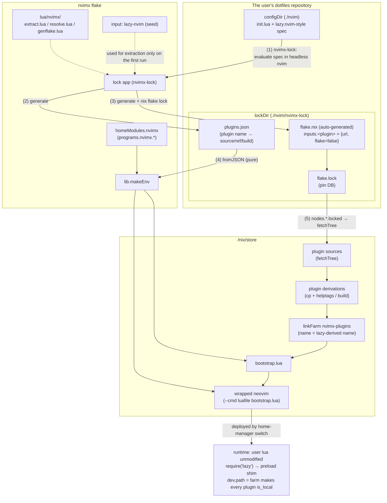
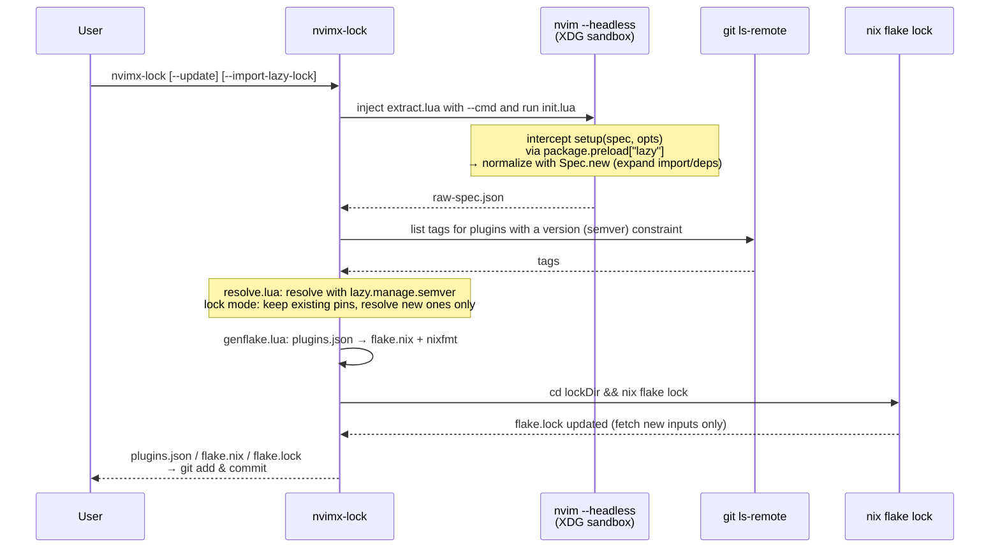
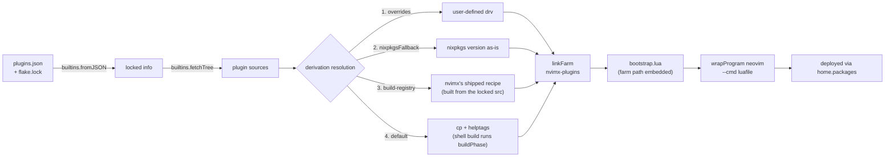

# nvimx architecture

## Overview

nvimx is a nix x neovim manager that combines "the flexibility of neovim's Lua" with "the reproducibility of nix".

- Provides a home-manager module that can be embedded in the user's dotfiles
- Parses lazy.nvim-style lua, fetches the required plugins, and pins them in flake.lock
- Lets the user freely choose neovim itself from nixpkgs or neovim-nightly-overlay

The model is **twist.nix style**: parse lua → fetch plugins from GitHub → place in /nix/store → symlink.
Lock information is stored by auto-generating an nvimx-specific flake.nix and pinning it with flake.lock.
`nix run .#lock` re-evaluates and updates it, and the home-manager build evaluates purely from flake.lock.

### Settled design decisions

1. **Parsing**: when `nix run .#lock` runs, a headless nvim actually evaluates the user's lazy spec (no IFD at evaluation time)
2. **Runtime**: lazy.nvim is used as-is. The user's lua runs unmodified
3. **Plugins with a build step** (telescope-fzf-native, etc.): fully supported from the start

## Architecture diagrams

### Big picture



### Lock flow (`nvimx-lock`)



### Build flow (`home-manager switch`, fully pure)



## Design principles

1. **The lock artifacts — the committed `plugins.json` + `flake.lock` — are the single source of truth**.
   At build time the JSON is simply read with `builtins.fromJSON`, so evaluation is fully pure.
   The initial `--impure` that twist.nix requires is unnecessary in principle (there is no unknown information left to resolve at evaluation time).
2. **Let lazy.nvim itself normalize the spec**.
   The plugin names derived by lazy's `Spec` are used verbatim as directory names in the symlink farm → the nix-side directory names and lazy's plugin names are guaranteed to match by construction (no hand-rolled reconciliation logic).
3. **The lock pipeline is unified on `nvim -l` (Lua)**.
   Reusing the semver module bundled with lazy.nvim (`lazy.manage.semver`) makes the version resolution semantics identical to lazy's.
4. **Runtime injection is limited to the wrapper's `--cmd luafile` + `package.preload["lazy"]`**.
   The user's lua stays unmodified.

## Data flow

### At lock time (`nvimx-lock` / `nix run .#lock`)

```
[1] Select the lazy.nvim used for extraction:
      the one in the user's lock if present (locked store path)
      otherwise the seed from nvimx's own flake input (resolves the chicken-and-egg problem)
[2] Extraction: sandbox XDG_{CONFIG,DATA,STATE,CACHE}_HOME and run
      nvim --headless --cmd "luafile extract.lua"
      - intercept setup(spec, opts) via package.preload["lazy"] (the real setup is never called)
      - Config.setup (merging safe opts) → Spec.new(spec, {pkg=false}) to normalize
        (recursive import resolution, fragment merging, dependency expansion — all lazy's own logic)
      - defaults.version (an opts key lazy only ever applies at git-operation time) is materialized
        into each eligible plugin's version here, so it is not lost (#42); a plugin with its own
        version / branch / tag / commit is left untouched
      → raw-spec.json
[3] Resolution: nvim -l resolve.lua <raw-spec.json> <plugins.json> [--prev <plugins.json>]
    [--lock <flake.lock>] [--lazy <lazy.nvim path>]
      - resolve version (semver range) with git ls-remote --tags --refs + lazy.manage.semver
        (loaded from --lazy, required whenever a constraint needs resolving)
      - a constraint that matches nothing is fatal if the plugin wrote it itself, but falls back
        to the default branch (like lazy) if it came from `defaults.version` -- see the severity
        table below
      - merge with --prev: a ref already decided is kept while the spec identity is unchanged,
        and pin = true freezes onto the rev --lock records (the lock app decides whether that
        state exists and passes it in; resolve.lua only reads what it is handed)
      - update mode: re-resolve everything
      → plugins.json
[4] Generation: nvim -l genflake.lua
      → lockDir/flake.nix (inputs.<name> = { url = ...; flake = false; }, outputs = _: {})
      → formatted with nixfmt
[5] Place it in lockDir and run (cd lockDir && nix flake lock)
      → generate/update flake.lock (in lock mode existing nodes stay untouched, only new ones are fetched)
[6] Resolve once more against the fresh flake.lock, to freeze the pins that had no rev in [3].
      Only if that changes plugins.json are [4] and [5] redone; the pass after it is a no-op.
```

### At build time (`home-manager switch`) — fully pure, no network required

```
[1] Read lockDir/plugins.json + flake.lock with builtins.fromJSON
      NOTE: the lock flake is never evaluated as a flake. flake.lock is just a pin DB
[2] nodes.<inputName>.locked → builtins.fetchTree → src
[3] Turn plugins into derivations: overrides > nixpkgsFallback > build-registry > default (cp + helptags)
[4] linkFarm "nvimx-plugins" [ { name = <lazy-derived name>; path = drv; } ... ]
[5] Generate bootstrap.lua (embedding the farm path and the forced opts)
      → wrapProgram neovim (the user-selected package) with --cmd 'luafile <bootstrap.lua>'
[6] hm deployment:
      home.packages = [ wrapped-nvim, nvimx-lock ]
      xdg.configFile."nvim" = configDir            (when manageConfig = true)
      xdg.dataFile."nvim/lazy/lazy.nvim" → farm/lazy.nvim
        (neutralizes the git clone in the user's existing bootstrap snippet)
```

At runtime the user's init.lua runs as-is, and `require("lazy")` goes through the preload shim so that `setup` receives the merged forced opts. Every plugin is treated as `is_local` via `dev.path = farm, patterns = {""}, fallback = false` → lazy's git/install pipeline is skipped entirely and everything is loaded from the store.

## Main components

### plugins.json schema

```jsonc
{
  "schemaVersion": 1,
  "lazyNvim": { "inputName": "lazy-nvim", "synthetic": true },  // always present
  "plugins": {
    "telescope.nvim": {                     // key = plugin name derived by lazy (= farm dir name)
      "inputName": "telescope-nvim",        // flake input name ([^A-Za-z0-9_-] → "-")
      "source": { "type": "github", "owner": "nvim-telescope", "repo": "telescope.nvim" },
      "branch": null, "tag": null, "commit": null,
      "version": "^0.1",                    // the effective semver constraint: the plugin's own
                                            // "version", or defaults.version materialized for it (#42)
      "pin": null,                          // lazy's `pin` (true | null; null = not set)
      "dependencies": [ "plenary.nvim" ],   // always an array, sorted by name (order carries no meaning)
      "resolvedRef": "refs/tags/0.1.8",     // the ref decided at lock time (see below)
      "build": { "kind": "none" }           // "none" | "shell" | "excmd" | "function" | "rockspec" | "luafile" | "steps"
    }
  },
  "localPlugins": { "myplugin": { "dir": "~/projects/myplugin" } },  // dir-specified. not locked
  "warnings": [ "..." ]
}
```

A table-form spec build (`build = { "make", ":TSUpdate" }`) expands into `"kind": "steps"` rather than
being collapsed to a single placeholder; each element is classified the same way a scalar build would be,
so a list of shell commands can still run even when it is mixed with steps that cannot:

```jsonc
"build": {
  "kind": "steps",
  "steps": [
    { "kind": "shell", "cmd": "make" },
    { "kind": "excmd", "cmd": ":TSUpdate" }
  ]
}
```

- Plugins with a literal `enabled = false` are excluded. Those with a function or `cond` are **included** (a superset of the machine-dependent branches is locked). A plugin whose fragments are *all* `optional = true` is excluded too: lazy's own `Meta:fix_optional` drops it from the spec before nvimx ever sees it, so nothing is left to lock
- The `lazyNvim` entry is always present: extraction and runtime from the second run onward use the same locked lazy.nvim, preventing version skew in the name derivation rules

`resolvedRef` is "the ref nvimx itself decided at lock time", and takes one of three forms:

| value | written by | example |
|---|---|---|
| `null` | nothing to decide (follows a branch / the default HEAD, or `commit` already says it) | — |
| a 40-hex rev | `pin = true`, frozen onto the rev in `flake.lock` | `"a1b2c3..."` |
| `refs/tags/<tag>` | semver resolution of `version` | `"refs/tags/v0.1.8"` |

**Merge contract.** `plugins.json` is read back at the start of the next lock and merged into, rather than regenerated. The *spec identity* of a plugin is `source` + `branch` + `tag` + `commit` + `version`; while it is unchanged, `resolvedRef` is carried over verbatim, and the moment it changes `resolvedRef` drops back to `null` and is decided again. Nothing else re-decides it: `pin`, `dependencies` and `build` are refreshed from the spec on every run but never invalidate a decision. `warnings` is derived every run and is not lock state.

### lazy spec → flake input URL mapping

| lazy spec | flake input URL | behavior of `nix flake update` |
|---|---|---|
| unspecified | `github:owner/repo` | follows the default branch HEAD |
| `branch = "b"` | `github:owner/repo/b` | follows the branch HEAD |
| `tag = "t"` | `github:owner/repo/refs/tags/t` | frozen |
| `commit = "sha"` | `github:owner/repo/<sha>` | frozen |
| `version = "^1.2"` | `refs/tags/vX.Y.Z` for the resolved tag, or `null` (default branch HEAD) if nothing matched and the constraint came from `defaults.version` | frozen (re-resolved with `--update`), or follows the default branch on a fallback |
| `pin = true` | freezes the current lock's rev into `resolvedRef`, so the URL itself names the rev -- unless `version` is also set and this is the very first lock (no rev to freeze onto yet), in which case semver resolves it to a tag ref instead; see the caveat below | frozen, except see below |
| explicit git URL | `git+https://...?ref=...&rev=...` (github.com is normalized to the github type) | follows the ref unless a rev is pinned |

**semver resolution**: the tag list is obtained with `git ls-remote --tags --refs <url>` (not preferring peeled `^{}` -- `--refs` excludes those from the output entirely) and lazy's bundled `lazy.manage.semver` is called from `nvim -l` (loaded from the path `--lazy` points resolve.lua at). The GitHub API is not used (rate limits, and non-GitHub support). `resolvedRef` records the tag *ref* (`refs/tags/<name>`), not its commit -- pinning that ref to a rev is `nix flake lock`'s job, the same fetcher step that peels an annotated tag. A constraint that matches no tag is fatal when the plugin wrote `version` itself (a likely typo, worth stopping the lock over), but falls back to the default branch -- exactly like lazy itself -- when it was materialized from `defaults.version` (a config-wide best-effort, not a promise about any one plugin's tags); either way, `git ls-remote` failing outright or a constraint `lazy.manage.semver` cannot parse is always fatal.

**Caveat on `pin = true` + `version`**: the "the URL itself names the rev" guarantee in the table above is about a 40-hex freeze, which is what pinning normally produces. If a pinned plugin also carries `version` and gets resolved for the very first time (no rev in `flake.lock` yet to freeze onto), the result is a `refs/tags/<tag>` ref instead -- and unlike a 40-hex rev, that ref can move if the upstream repo moves the tag, since resolving a tag ref to a commit happens fresh on every `nix flake lock`. This is a weaker guarantee than the 40-hex case and is accepted as such; see `resolve.lua`'s merge comment for the same note next to the code.

### Update semantics

- `nvimx-lock`: only adds new plugins and removes deleted ones. Existing pins stay untouched
- Editing the spec beats `pin`. Changing the `branch` / `tag` / `commit` / `version` / source of a pinned plugin is an explicit request, so the frozen rev is dropped and the plugin is resolved again (lazy's own `pin` behaves the same way: it stops `:Lazy update`, not you). A `tag` that gets moved upstream is therefore *not* followed while pinned -- rename the tag in the spec, or use `--update <name>`
- Editing `defaults.version` counts as editing the `version` of every plugin it materializes into (#42): each such plugin's spec identity changes and its `resolvedRef` is decided again, same as if that plugin's own `version` had been edited by hand
- A `version`-resolved tag that gets moved upstream is *not* followed while the spec is unchanged: `resolvedRef` is only carried, never re-checked against the remote, once it is set (the same rule that lets a second lock run skip the network entirely, see below). `--update <name>` is the way to force a re-resolve
- A plugin whose `defaults.version` constraint matches no tag today can gain a `resolvedRef` on a later lock with no config change at all, once upstream starts tagging releases -- `defaults.version` is evaluated fresh every run, exactly as it is by lazy itself, so this is expected rather than a bug
- Removing `pin` thaws the plugin: the frozen rev is dropped and it goes back to following its branch/tag. It has to be, because the frozen rev is part of the input URL, so `nix flake update` cannot undo a freeze on its own
- `pin` also beats a `version` constraint: the frozen rev is whatever the lock held, and it is never checked against the range. `nvimx-lock` warns about this on every run rather than freezing silently
- `nvimx-lock` runs the resolver twice, on either side of `nix flake lock`. A plugin pinned for the first time has no rev in `flake.lock` yet, so the second pass is what freezes it; the flake is regenerated and re-locked only if that pass changed anything. One retry always suffices, because the third pass would read the same `flake.lock` back
- `nvimx-lock --update [name...]`: re-resolves version constraints + `nix flake update [name...]`
- Back door: plain `nix flake update <inputName>` in lockDir also works (same as twist), but it cannot move a pinned plugin -- a frozen rev is part of the input URL, not just of `flake.lock`
- `nvimx-lock --import-lazy-lock <path>`: pins from an existing lazy-lock.json's `{branch, commit}` on the first run for a bit-identical migration. Returns to normal tracking at `--update` time

### Plugin derivations (1 plugin = 1 derivation)

Using the fetchTree result directly was rejected: helptags are not generated so `:h` breaks, and build integration becomes impossible.

- **Default**: `mkDerivation` that unpacks the src, runs the recorded shell step(s) if there are
  any, copies the resulting tree to `$out`, and generates helptags if `doc/` exists.
  `stdenvNoCC` is used unless there is at least one shell step, so a pure-lua plugin never drags
  the C toolchain into its build closure.
  `vimUtils.buildVimPlugin` produces too many false positives in its require check, so it is not used by default.
  `dontFixup = true`: the plugin tree must reach the farm exactly as upstream shipped it
  (stdenv's `move-docs` hook would relocate `doc/` to `share/doc/` and break `:h`, and `patchShebangs`
  would rewrite files such as `#!/usr/bin/env -S nvim -l`)
- **Build resolution order** (implemented in `nix/lib/resolve-plugin.nix`, the single place where
  "a plugin name + its locked src" becomes a derivation). A per-user opt-in outranks a shipped default,
  which is why 2 sits above 3:
  1. The user's `plugins.overrides."<lazy name>" = { pkgs, name, src, build, defaultDrv, ... }: drv;`
     — `src` is the locked source tree and `defaultDrv` is **the derivation that would have been used
     without this override** (i.e. the result of 2–4), so patching (`defaultDrv.overrideAttrs`) and
     replacing it outright are both one-liners. Overrides must accept `...`: more arguments may be added later
  2. `plugins.nixpkgsFallback = [ "..." ]` (opt-in): use the nixpkgs version as-is (automatic name matching is
     not done because it would break pin consistency). nixpkgs has no single spelling to normalize to,
     so the `pkgs.vimPlugins` attribute is looked up under three names, most faithful first: verbatim
     (`LazyVim`), then `.` replaced by `-` (`CopilotChat.nvim` → `CopilotChat-nvim`), then lowercased on
     top of that (`telescope.nvim` → `telescope-nvim`).
     A name that resolves to none of the three **throws at evaluation time** and points at `plugins.overrides`
  3. Built-in registry (`nix/build-registry/`): nvimx's own build recipes for plugins whose declared build
     is wrong, absent, or impossible in the sandbox — so that they work with no user configuration.
     One file per plugin, keyed by the lazy name, and each entry is a function of exactly the same shape as
     an override plus one extra argument, `mkPluginDrv` (the generic builder), so a recipe can move between
     the registry and a user's `plugins.overrides` unchanged. Entries build from the **locked src**:
     substituting a `pkgs.vimPlugins` attribute wholesale would detach the plugin from its pin, which is what
     the opt-in 2 above is for (borrowing a *companion binary* that cannot be produced offline from the locked
     src either — `fzf` — is the one carve-out). Because an entry applies to everyone, it must also hold for
     any rev the user may have pinned — version-sensitive patching belongs in `plugins.overrides`.
     Shipped today: `telescope-fzf-native.nvim` (always the Makefile, whatever the spec declared),
     `fzf` (`bin/fzf` from nixpkgs instead of the release binary `./install --bin` downloads; keyed by a
     name generic enough to collide, so the build asserts the tree really is junegunn/fzf), and
     `nvim-treesitter` (always copy + helptags, ignoring whatever build the spec declared — on the
     `main` branch layout its Makefile fetches dependencies over the network for every target, so it
     can never succeed in the sandbox; parsers come from `treesitter.grammars` below instead)
  4. `build.kind == "shell"` runs `build.cmd` in `buildPhase`, in the unpacked source directory
     (make/cmake-style builds that need no network work this way). `build.kind == "steps"` is the
     same thing applied to a table-form spec build (`build = { "make", ":TSUpdate" }`): its `shell`
     elements run **in declared order**, each in its own subshell (one per shell step, with `cwd`
     reset to the plugin root for every one) so that a `cd` in one step cannot leak into
     the next step or into `installPhase` — this also fixed a pre-existing bug where a scalar
     `build.cmd` that itself `cd`'d could leak into `installPhase` and corrupt `$out`. Elements that
     are not `shell` (`excmd` / `function` / `rockspec` / `luafile`) are simply skipped, in place,
     without disturbing the steps around them. The tools available to a shell step are whatever
     stdenv provides (cc, gnumake, coreutils, gnused/gnugrep/gawk, findutils, tar/gzip/bzip2/xz,
     patch, diffutils, bash) plus `cmake` and `pkg-config`; anything beyond that needs 1–3.
     `excmd` / `function` / `rockspec` / `luafile` cannot run in the sandbox at all (`function` is
     every non-string element; `rockspec` is lazy's luarocks integration, which nvimx disables during
     extraction anyway; `luafile` is a `*.lua` path lazy `loadfile`s from inside a live neovim with the
     plugin already loaded — nothing the sandbox can reproduce), so `resolve.lua` warns about them
     **at lock time** (naming the three hatches above, and `treesitter.grammars` for
     `nvim-treesitter`), whether that is the plugin's whole build or just some of a `steps` list — in
     the latter case the warning also says which steps still run. Whatever cannot run is skipped
     rather than attempted; the plugin still gets whatever shell steps *can* run, plus helptags.
     resolve.lua runs before any Nix evaluation, so it cannot know whether 1–3 already cover the
     plugin — the warning fires regardless

  1–3 only ever apply to plugins in the lock; the lazy.nvim seed is nvimx's own foundation and is
  not overridable. A name matching nothing in the lock is a typo that would silently do nothing, so
  `makeEnv` reports it as `unknownPluginNames` and the module turns that into an activation warning.
  Steps 3 and 4 stay **unevaluated** until something forces them — that laziness is what lets 1 and 2
  rescue a plugin whose build would otherwise throw (see below)
- **Builds that need the network**: a sandboxed build can never reach a package registry, so
  `nix/lib/build-network.nix` inspects the first word of every command segment against a list of
  fetching tools (`cargo` / `npm` / `go` / `curl` / `git` / ...) and **throws at evaluation time** with a
  message naming the build-registry / `plugins.overrides` / `plugins.nixpkgsFallback` escape hatches,
  instead of letting the build die later with an opaque fetch error.
  Quoted text is stripped first, and `$(...)` / backticks are inspected as their own segments.
  Matching is deliberately first-word-only and fails **open**: a false positive is a hard evaluation
  failure for the user, so a command that hides its real work (`sh -c "npm install"`, `make deps`)
  is attempted and left to die in the sandbox rather than guessed at
- **nvim-treesitter** (`nix/lib/treesitter.nix`): the locked plugin plus nixpkgs' grammars are **merged into a single derivation with symlinkJoin** (self-contained in a single farm entry; a separate rtp entry was rejected because it conflicts with `performance.rtp.reset`).
  `treesitter.grammars = "all" | [ names ] | null`, where the names are nvim-treesitter's own language names.
  The merge sits **on top of** resolution, so `plugins.overrides` / `plugins.nixpkgsFallback` still decide what the plugin
  itself is; `null` (the default) is the opt-out and leaves the resolved derivation untouched.
  Grammars come from `pkgs.vimPlugins.nvim-treesitter.grammarPlugins` rather than `pkgs.tree-sitter-grammars`:
  nixpkgs keys that set by nvim-treesitter's language names and already lays each grammar out as `parser/<lang>.so`,
  which is exactly what neovim looks for on the runtimepath. A grammar's `requires` are pulled in transitively,
  the same expansion nvim-treesitter's own installer does. Queries always come from the **locked** plugin: on the
  `main` layout they live under `runtime/queries/` (off the runtimepath) and upstream links only the installed
  languages into place at `:TSInstall` time, so the merge does that same linking at build time for the selected
  languages; on the `master` layout `queries/` is already at the plugin root and nothing is linked.
  Selecting grammars with no nvim-treesitter in the lock is reported as `treesitterWithoutPlugin` and warned about
  at activation time, like `unknownPluginNames`.
  The slight mismatch between the grammar revs and the plugin rev is a known limitation (future work: a strict mode that builds grammars directly from the locked src's lockfile)

### Runtime injection (bootstrap.lua)

1. `vim.opt.rtp:prepend(farm .. "/lazy.nvim")`
2. Register `package.preload["lazy"]`: on the first require it unregisters itself → requires the real module → monkeypatches `setup` (handling both `setup(spec, opts)` and `setup(opts)`) → merges the forced opts with `vim.tbl_deep_extend("force", ...)`
3. Forced opts: `install.missing=false`, `checker.enabled=false`, `change_detection.enabled=false`, `pkg.enabled=false`, `rocks.enabled=false`, `readme.enabled=false`, `dev = { path = <function>, patterns = {""}, fallback = false }`
4. **dev.path is a function**: names listed in `devPlugins` return `devPath` (e.g. `~/projects`), everything else returns the farm → this keeps the user's own local plugin development (dev=true) workflow intact
5. `xdg.dataFile."<app>/lazy/lazy.nvim"` symlinks to the farm so that the `fs_stat` in the user's standard bootstrap snippet succeeds and no git clone runs

Consistency with the read-only store: a plugin whose `dir` is not under the lazy root becomes `is_local = true`, which makes lazy skip all git tasks (clone/fetch/checkout/status, etc.) and the whole install pipeline (guaranteed by lazy.nvim's implementation).

## home-manager module interface

The module embeds `lib.makeEnv` (a deliberate divergence from twist: twist targets distributing multiple profiles, whereas nvimx's main use case is "one nvim in your dotfiles", where the UX of configuring things in a single place wins). Advanced users may still specify `programs.nvimx.env` directly.

```nix
programs.nvimx = {
  enable = true;

  # Choosing neovim itself: just pass an -unwrapped style drv
  package = pkgs.neovim-unwrapped;
  # package = inputs.neovim-nightly-overlay.packages.${pkgs.system}.default;

  configDir = ./nvim;              # lua config (path type → goes to the store)
  lockDir   = ./nvim/nvimx-lock;   # plugins.json / flake.nix / flake.lock

  manageConfig = true;             # true: deploy from the store via xdg.configFile (reproducibility-first, default)
                                   # false: ~/.config/nvim is user-managed (for fast iteration)

  plugins = {
    overrides = { };               # per-plugin derivation overrides
    nixpkgsFallback = [ ];         # plugin names to take from nixpkgs as-is (opt-in)
  };
  treesitter.grammars = null;      # "all" | [ names ] | null (default: null, i.e. nvim-treesitter untouched)

  devPlugins = [ ];                # names of plugins under local development
  devPath = "~/projects";

  extraPackages = [ ];             # prepended to the wrapper's PATH (ripgrep, lsp, etc.)
  extraLuaPackages = ps: [ ];      # manual luarocks dependencies (escape hatch)

  lock = {
    installCommand = true;         # add nvimx-lock to home.packages
    projectDir = "~/dotfiles";
    lockDirRelative = "nvim/nvimx-lock";
  };
};
```

**When the lock is absent, the build degrades** (farm = the lazy.nvim seed only + a warning at activation time).
Since the lock command itself is a product of the hm build, failing evaluation would create a chicken-and-egg problem. Even in degraded mode `nvimx-lock` lands on PATH, so `nvimx-lock` → commit → `home-manager switch` reaches the complete state. `--impure` is never needed.

## Usage flow from the user's perspective

```nix
# flake.nix of your dotfiles
{
  inputs = {
    nixpkgs.url = "github:nixos/nixpkgs/nixpkgs-unstable";
    home-manager.url = "github:nix-community/home-manager";
    nvimx.url = "github:myuron/nvimx";
  };
  outputs = { nixpkgs, home-manager, nvimx, ... }: {
    homeConfigurations.myuron = home-manager.lib.homeManagerConfiguration {
      pkgs = import nixpkgs { system = "x86_64-linux"; };
      modules = [
        nvimx.homeModules.nvimx
        {
          programs.nvimx = {
            enable = true;
            configDir = ./nvim;
            lockDir = ./nvim/nvimx-lock;
          };
        }
      ];
    };
  };
}
```

- **First run**: `nix run github:myuron/nvimx#lock -- --config ./nvim --out ./nvim/nvimx-lock`
  (coming from an existing lazy setup, add `--import-lazy-lock ~/.config/nvim/lazy-lock.json`)
  → `git add` → `home-manager switch`. Switching first (degraded) and running `nvimx-lock` afterwards also works
- **Adding a plugin**: write the spec in lua → `git add` → `nvimx-lock` (fetches only the new inputs) → commit → switch.
  Even if you forget to lock and switch anyway, nvim still starts and only that plugin shows as not installed (safe failure)
- **Updating**: `nvimx-lock --update` (everything) / `nvimx-lock --update telescope.nvim` (individual) → switch.
  As long as flake.lock does not move, switching any number of times yields the same result

## Repository layout

```
flake.nix                    # adds the lazy-nvim input, extends outputs
stylua.toml                  # lua formatting, read by `nix fmt` (treefmt -> stylua) and editors/LSP
.luacheckrc                  # lua linting config for `nix fmt` (treefmt -> luacheck) and editors/LSP
nix/
  lib/
    default.nix              # lib entry point (makeEnv, mkLockApp)
    make-env.nix             # the core of env assembly
    sources.nix              # flake.lock JSON → name → fetchTree src
    plugin-drv.nix           # turning 1 plugin into a derivation (the generic path: helptags / shell build)
    resolve-plugin.nix       # picking the derivation: overrides / nixpkgsFallback / registry / generic
    build-network.nix        # detecting build commands that cannot run in the sandbox
    farm.nix                 # linkFarm construction
    bootstrap.nix            # bootstrap.lua generation
    wrapper.nix              # wrapProgram for neovim
    treesitter.nix           # nvim-treesitter + grammar merge derivation
    lock-app.nix             # lock script (writeShellApplication)
  build-registry/            # name → build recipe (default.nix = the index + how to add an entry)
    telescope-fzf-native.nvim.nix
    fzf.nix
  home-manager/default.nix   # the programs.nvimx module
lua/nvimx/
  extract.lua                # preload shim + spec capture + normalization + JSON dump
  resolve.lua                # semver resolution (git ls-remote) + merge with the previous plugins.json
  version.lua                # pure: parse ls-remote output, pick the winning tag for a constraint
  genflake.lua               # plugins.json → lock/flake.nix text generation
  bootstrap.lua.in           # runtime bootstrap template (not `*.lua`, so stylua/luacheck skip it)
templates/default/           # template for embedding into dotfiles
tests/fixtures/              # basic-config / build-plugins / build-steps-config / registry-plugins / treesitter-config / unbuildable-config / local-plugin / empty-config / merge / merge-config / defaults-version-config / defaults-version-false-config / semver / golden/
```

flake outputs:

- `lib.{makeEnv, mkLockApp}`
- `homeModules.nvimx`
- `apps.x86_64-linux.lock` (standalone, for bootstrapping and CI)
- `packages.x86_64-linux.demo` (for smoke testing and dogfooding with the fixtures)
- `checks.<system>.{extractor-snapshot, extractor-no-setup, extractor-defaults-version, semver-select, resolve-merge, resolve-semver, resolve-build-warnings, build-shell, plugin-drv-phases, build-network-detect, build-registry, treesitter-grammars, hm-module, hm-module-degrade, hm-module-plugins, hm-module-treesitter, plugins-overrides, plugins-nixpkgs-fallback, plugins-escape-hatch, wrapper-aliases}`
  - planned, not yet implemented: `genflake-golden` (#29), `e2e-offline` (#30)
  (e2e-offline is a network-free E2E using a fixture lock with path-type inputs)
- `templates.default`

## Edge cases and explicit limitations

| Case | Behavior / handling |
|---|---|
| First bootstrap (no lock) | degraded build + warning. `--impure` not needed |
| Adding a plugin to lua after locking, then switching | evaluation succeeds, only that plugin shows as not installed. A warning prompts you to re-run lock |
| lua files not tracked by git | they are not part of the flake source, so they are missed during extraction → the lock app detects working-tree differences and warns |
| Non-GitHub / explicit git URL | normalized to a `git+https://` / `git+ssh://` input |
| Plugin name collision | surfaces during lazy's Spec normalization (same behavior as lazy). inputName collisions are an error at lock time |
| build is a Lua function / excmd / rockspec / a `*.lua` file, or `false` | cannot be run automatically (`false` is lazy's own "do not build" and warns about nothing). Warns at lock time and points to registry / overrides / nixpkgsFallback |
| build is a table of steps | each element is classified individually and recorded in order (`build.kind == "steps"`); `shell` elements run in declared order, each in its own subshell, and the rest are skipped. A warning fires only if at least one element cannot run, and names which steps those are |
| build is a shell command (or step) needing the network | detected at evaluation time and thrown with a message naming the same three escape hatches |
| luarocks (rocks) | **explicitly unsupported**. `rocks.enabled=false` is forced during extraction, so a `build = "rockspec"` (or a `rockspec` element inside a table build) is recorded as `{ kind: "rockspec" }` and never run; warned about at lock time like any other unrunnable build |
| Machine-dependent spec (`enabled = fn`, `cond`) | the superset is locked. `if` branching on the spec list itself only captures the branch taken on the machine running lock (documented) |
| Local plugin development (dev=true) | supported alongside via `devPlugins` / `devPath` + the dev.path function |
| lazy writing state | stdpath(data/state/cache) is user-owned territory, so this is fine |
| Slight mismatch in treesitter grammar revs | known limitation. A strict mode is planned |

## Implementation phases

Each phase ends with an artifact you can actually try out:

1. **Extractor** (highest risk first): `extract.lua` + fixture → raw-spec.json, `checks.extractor-snapshot`. Add lazy-nvim as a flake input
2. **Lock pipeline**: `genflake.lua` + lock app → `nix run .#lock` produces a full lockDir, golden tests
3. **Build path**: sources / plugin-drv / farm / bootstrap / wrapper → verify with `packages.demo` that `:Lazy` shows everything loaded/local. Start dogfooding
4. **hm module + template**: `programs.nvimx.*`, degraded mode, `nvimx-lock`, E2E against real dotfiles
5. **Full build-plugin support**: build-registry, shell builds, the treesitter merge drv, nixpkgsFallback, warnings at lock time
6. **Version/update features**: `resolve.lua` (semver), `--update [name]`, pin-preserving merge, `--import-lazy-lock`
7. **Finishing touches**: devPlugins, extraLuaPackages, non-GitHub validation, `checks.e2e-offline`, README

## How to verify

- Phase 1-2: run `nvim --headless --cmd "luafile extract.lua"` against the fixture config → inspect the JSON → turn it into a snapshot check. After `nix run .#lock`, `cd lockDir && nix flake lock` must succeed
- Phase 3 onward: `nix build .#demo && ./result/bin/nvim`, open `:Lazy` and confirm every plugin is loaded/local (no git operations) and that `:h telescope` works
- Phase 4: against real dotfiles, `nvimx-lock` → commit → `home-manager switch` → switching again with flake.lock unchanged must give the same result
- CI: `nix flake check` (offline checks) + confirming `nix fmt` has been applied.
  `nix fmt` covers both nix (nixfmt) and lua (stylua for formatting, luacheck for linting via
  `settings.formatter.luacheck`, since treefmt-nix has no `programs.luacheck`); `nix fmt -- --ci`
  fails on unformatted or lint-failing lua the same way it fails on unformatted nix.
  `lua/nvimx/bootstrap.lua.in` does not match `*.lua` and is excluded from both of them.

## Appendix: main divergences from twist.nix

| Item | twist.nix | nvimx | Rationale |
|---|---|---|---|
| When package resolution happens | at evaluation time (an elisp parser in pure Nix) | at lock time (headless nvim) | Lua cannot be parsed in pure Nix. Resolving at lock time makes evaluation fully pure, so `--impure` is unnecessary |
| Persisting the resolution result | metadata.json (an option to avoid IFD) | plugins.json (mandatory, the single source of truth) | same as above |
| Handling of the lock flake | importJSON the flake.lock + fetchTree | same | adopts a proven pattern as-is |
| Where the env is assembled | on the packages side of the user's flake | embedded in the hm module (direct env specification also possible) | for the single-profile use case, configuring in one place wins |
| Behavior when nothing is pinned | falls back to an impure fetch | degraded build | there is no unknown information at evaluation time, so impure has no role to play |
